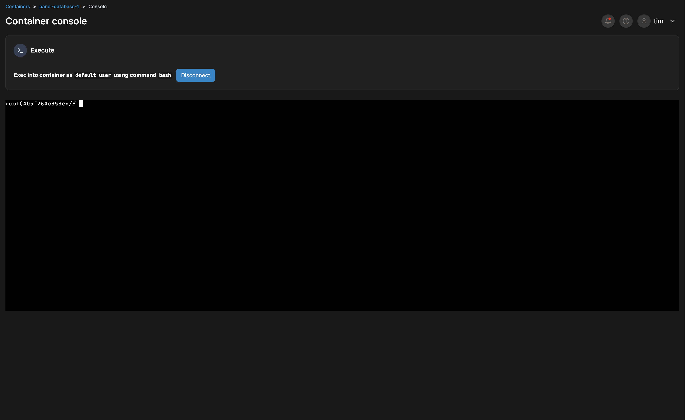

# Fine tuning Language Models - Toxic Tweets

## Milestone 1

## Docker Installation 
I had Docker Installed on all machines already. I followed the guides on the official [Docker Website](https://docs.docker.com/engine/install/ubuntu/).\
I will be using my home server which runs on linux and will be managing it all through Portainer where\
I manage all my docker containers.

## Portainer 

## Docker 

## Milestone 2

## Streamlit

