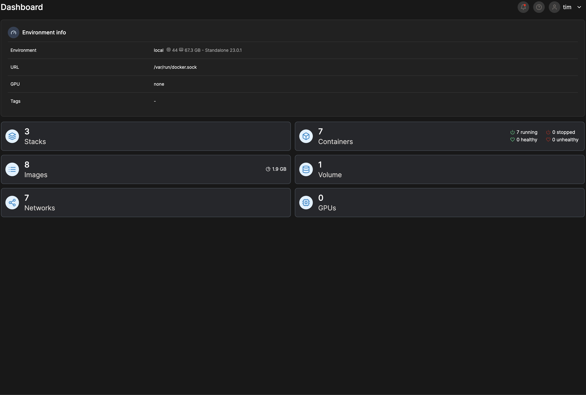
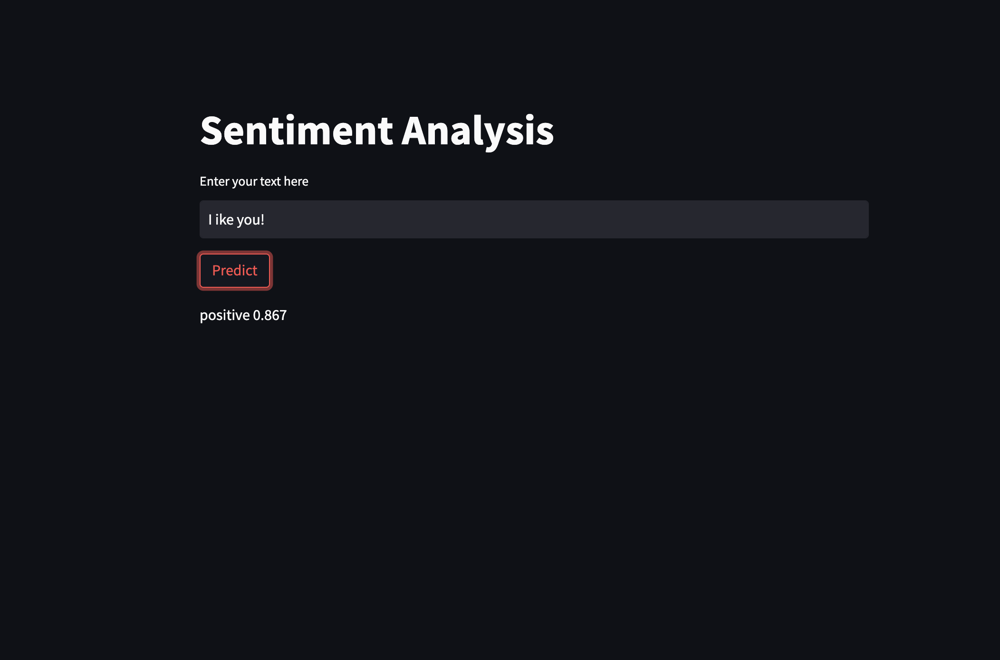
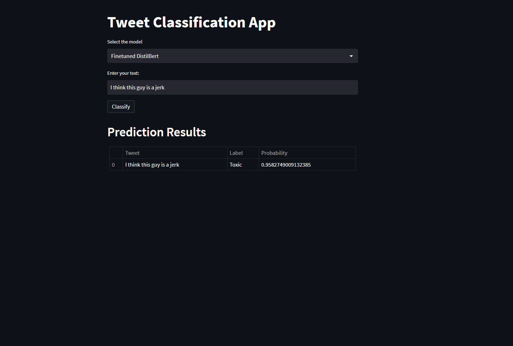
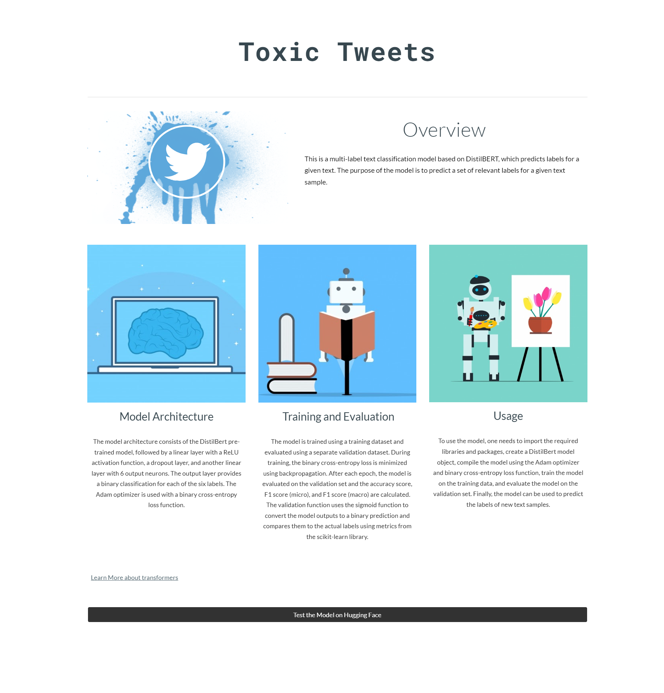

# Fine tuning Language Models - Toxic Tweets

## Milestone 1

### Docker Installation

I had Docker Installed on all machines already. I followed the guides on the official [Docker Website](https://docs.docker.com/engine/install/ubuntu/).\
I will be using my home server which runs on linux and will be managing it all through Portainer where\
I manage all my docker containers.

### Portainer

## Docker

## Milestone 2

### Streamlit

## Milestone 3

### Streamlit

Link to the [App](https://huggingface.co/spaces/timo1227/Toxic-Tweets)

## Milestone 4

### Landing Page

Link to the [Landing Page](https://sites.google.com/njit.edu/toxictweets/)
Must be logged into NJIT Google Account to view.
